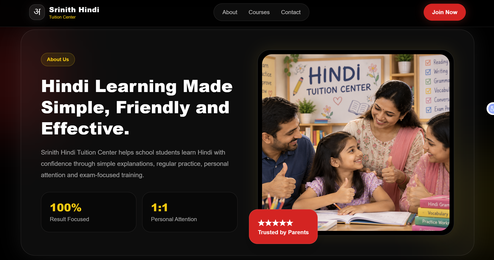

# 📚 Srinith Hindi Tuition Center

A modern and responsive website developed for Hindi Tuition Center.

## 📌 Project Overview

This website helps parents and students explore Hindi tuition
programs, learning opportunities, and contact information.

## 🚀 Features

- Responsive and user-friendly design
- Hindi course information
- Tutor introduction
- Student and parent testimonials
- Contact and enquiry section
- Mobile-friendly navigation

## 🛠️ Technologies Used

- React.js
- JavaScript
- Tailwind CSS
- Vite
- HTML5
- Netlify

## 📸 Screen shot

## ⚙️ Installation

1. Clone the repository:
   git clone <https://github.com/Ravikeerthy/srinith-hindi-class.git>

2. Install dependencies:
   npm install

3. Start the development server:
   npm run dev

## 🌐 Live Demo

https://srinith-hindi-course.netlify.app/

## 👩‍💻 Developer

Developed as a frontend web development project
using React.js and Tailwind CSS.